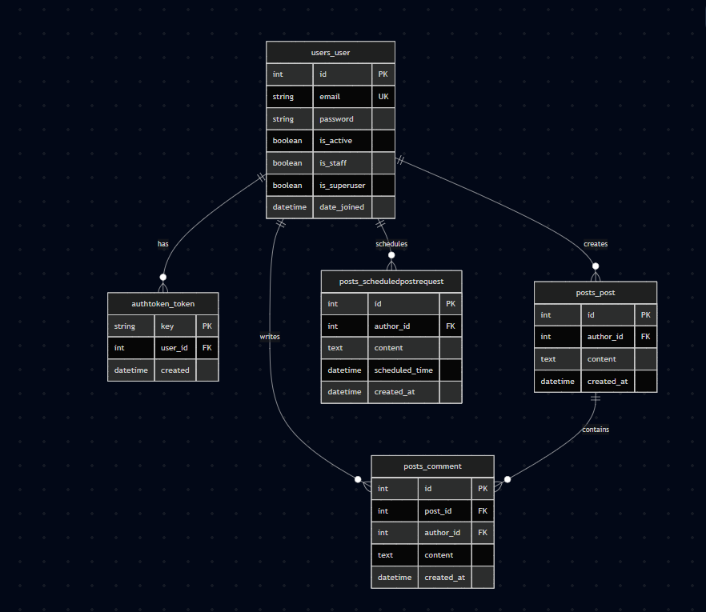

# Social Media API & Asynchronous Task Scheduler

A robust, production-ready Social Media REST API built with **Django REST Framework (DRF)**, **PostgreSQL**, **Docker**, and **Celery** for background task processing.

## 🚀 Features

* **Authentication**: Token-based authentication via DRF `TokenAuthentication`.
* **Content Management**: Full CRUD operations for Posts and Comments, plus a Like system.
* **Asynchronous Scheduling**: Celery & Redis integration for scheduling posts ahead of time (manageable both via API and Django Admin).
* **API Documentation**: Automated Swagger/OpenAPI documentation via `drf-spectacular`.
* **Containerization**: Fully dockerized architecture with explicit service dependencies.
* **Testing**: Comprehensive unit tests covering views, business logic, and mocked background tasks.

---

## 🛠️ Tech Stack

* **Backend**: Python 3.12, Django, Django REST Framework
* **Database**: PostgreSQL
* **Asynchronous Broker**: Celery, Redis
* **Containerization**: Docker, Docker Compose
* **Documentation**: drf-spectacular (Swagger UI)

---

## ⚙️ Quick Start (Running via Docker)

1. **Clone the repository:**
   ```bash
   git clone https://github.com/Sergio-zt/social_media_api
   cd social_media_api
   ```

2. **Create and configure your .env based on .env_example** 

3. **Build and run containers:**
    ```bash
    docker-compose up --build -d
    ```

4. **Run database migrations:**
    ```bash
    docker-compose exec web python manage.py migrate
    ```

5. **Create a superuser (to access Django Admin):**
    ```bash
    docker-compose exec web python manage.py createsuperuser
    ```

📖 API Documentation
Once the project is running, you can explore and test all endpoints via Swagger UI:

URL: http://127.0.0.1:8000/api/docs/

Django Admin: http://127.0.0.1:8000/admin/

🧪 Running Tests
**To execute the test suite inside the Docker container:**
    ```bash
    docker-compose exec web python manage.py test
    ```

**Data Base Schema:**
